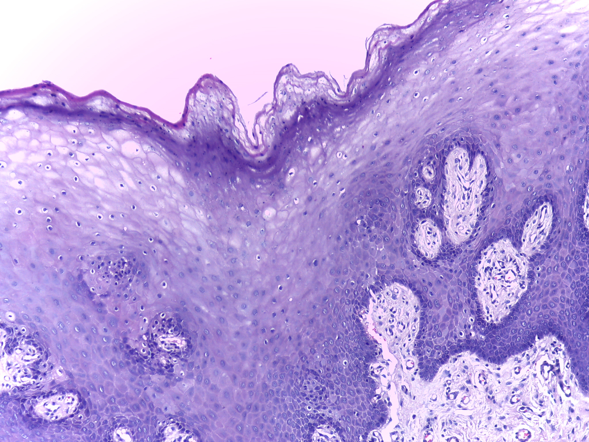
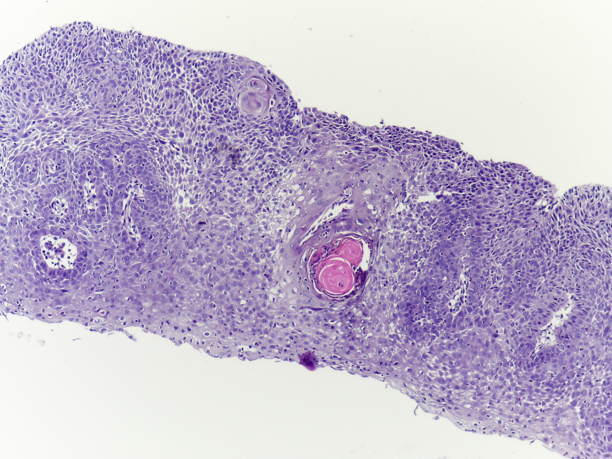
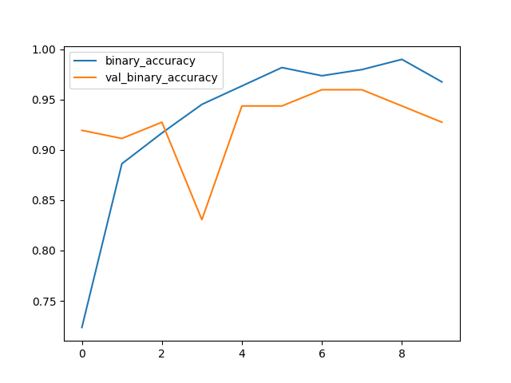
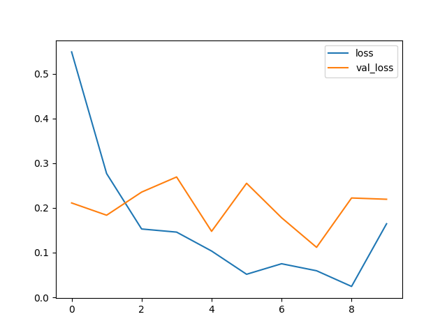

# OSCC Detection using Convolutional Neural Networks (CNN)

A TensorFlow keras sequential CNN model to differentiate between *Oral Squamous Cell Carcinoma (OSCC)* and *non-OSCC* from microscopic images. The model was trained on the [Mendeley Dataset](https://data.mendeley.com/datasets/ftmp4cvtmb/1) of histopathological images in 100x magnification.
## Sample Images

**Non-OSCC**



**OSCC**


## SMOTEN

The dataset of 100x Histopathological images that was used to train the model had significant class imbalance composed of 89 images with the normal epithelium of the oral cavity and 439 images of Oral Squamous Cell Carcinoma (OSCC). Initial attempts to train the model with the imbalanced dataset led to high accuracy with high bias towards class 1 (OSCC). To resolve the class imbalance, [SMOTEN](https://imbalanced-learn.org/stable/references/generated/imblearn.over_sampling.SMOTEN.html) (Synthetic Minority Over-sampling Technique for Nominal) was introduced which uses k-Nearest Neighbors to define the neighborhood of samples to use to generate the synthetic samples. Following the application of SMOTEN, a 1:1 ratio was achieved for the classes. This data was then shuffled to have a good mix in the training and validation datasets.
## Output

The intent is to train the head of the model first and then train the whole model again (EfficientNetB3 Base + Head) by setting ```pretrained_base.trainable = True``` after training the head to adjust the pretrained base weights to the new data. However, due to limited computational resources, only the head of the model was fitted to the dataset and it lead to the following results with possible imporvements provided more computational resources.




## Evaluation

The evaluation following training gave the following result:

**binary_accuracy:** 0.8805

**loss:** 0.4681


## Installation

**Using pip**

```bash
  git clone https://github.com/KushagraAgarwal525/OSCC_Neural_Detection.git
  cd OSCC_Neural_Detection
  pip install -r requirements.txt
```
    
## Usage

```bash
python detection.py [data_directory] [model].keras[optional]
```

*data_directory* : Path to the directory containing labelled dataset of images. The data used for this model had two sub-directories */0* for non-OSCC images and */1* for OSCC images.

*model (optional)*: The name with which you'd like your model to be saved. If not provided, model is not saved after fitting and evaluation.

## Client

To test the pre-trained model on your local machine, follow these steps.

```bash
cd client
pip install -r requirements.txt
python app.py
```
After your Flask server is running, go to the */predict* endpoint and you should be ready to test out the model!


## Improvements

A lot of improvements are being worked on to increase the accuracy and reduce loss, such as more even distribution of classes in the training, validation and test datasets, changes in model architecture, more evaluation metrics to gain a better understanding of the model performance, amongst others.
## Acknowledgements

 [^1]: [Rahman, Tabassum Yesmin (2019), “A histopathological image repository of normal epithelium of Oral Cavity and Oral Squamous Cell Carcinoma”, Mendeley Data, V1, doi: 10.17632/ftmp4cvtmb](https://data.mendeley.com/datasets/ftmp4cvtmb/1).
